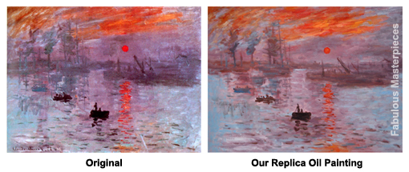

## Replica Repetition

Art history and history in general have been topics of interest for many people throughout time. This is proven as the pioneers of the art world as well as the founding creators of great and cherished pieces of art have been recognized and studied both- during and long after their deaths. It’s clear that some of their work was seen as being so precious that they were regularly protected, refurbished, and sometimes completely removed from their original sites and replaced with replicas in order to protect them and preserve them since they can often be priceless. 

 

A specific example that I relate to this concept are the circumstances that led to the David statue that was created out of marble by Michelangelo between 1501 and 1504 which originally stood in the Palazzo della Signoria, Italy in a courtyard. I remember visiting this statue and thinking about how long it must have been standing there and how it was amazing that nothing has harmed it. Then one day to much surprise I found out in an art history lecture that the original statue had been removed from in its original location in 1873 and then placed indoors to prevent the original masterpiece from being destroyed and was replaced by a replica in 1910. These types of solutions to preserve and maintain prominent works of art have been used time and time again around the world and is relatable to the concept of design patterns. 

Design patterns are solutions that have been worked out after a long period of time and that have become generalized in order to allow them to be applicable to other situations than that of their original use. They can be seen as almost a blueprint or a guide to solving a problem in software design as well as in many other areas of learning. These patterns can be applied to almost any subject since they are ways of making something that could be very complex- understandable for someone who is learning it for the first time.

## Copy Cat Strikes Back

With the studies of celebrated pieces of art, it is not uncommon to find that other artists often use these famous pieces of work as their templates to use to learn new techniques. By trying to recreate their work they can better understand the techniques that were being used by the original artists themselves. A software developer can sometimes operate similarly by using different patterns to help them come up with solutions for a project that they may be working on. Some of the most commonly used include prototype, observer, publish-subscribe, reactive, singleton, and Model-View-Controller design patterns. 

These are all examples of design patterns that I have become familiar with throughout the past semester. As the software engineering course I’ve been enrolled in utilized a flipped classroom teaching experience I learned by example through screencasts. By watching these videos, it is not unlike watching the work of a great artist being conjured up as the students are then instructed to use the videos as guides for the coursework. The maestro creates a vast and complex, working system that incorporates many different concepts that can almost all be boiled down to the patterns that were listed above. As I learned the concepts I was unaware that the learning techniques that we were using were based off of frameworks that have been so meticulously laid out.

Although we learned through example it was not uncommon for us to use copies of the files that were already created in the examples. Even though we- as students are often lectured time and time again about plagiarism- this copy cat instance is acceptable since we ultimately change our files for our own use and must ultimately prove our understandings through our assignments. This concept is actually touched upon quite heavily within the prototype and singleton design patterns and is not unlike attempting to recreate masterpieces to learn the techniques of the “greats” who came before us.
