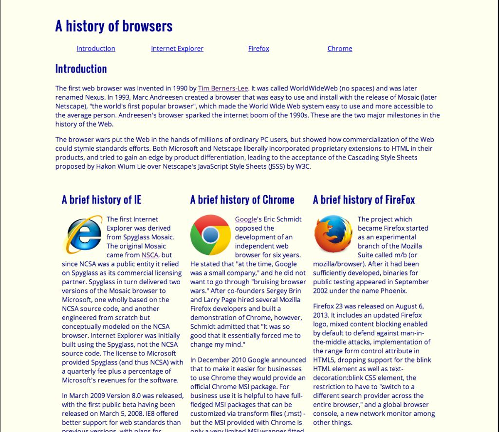
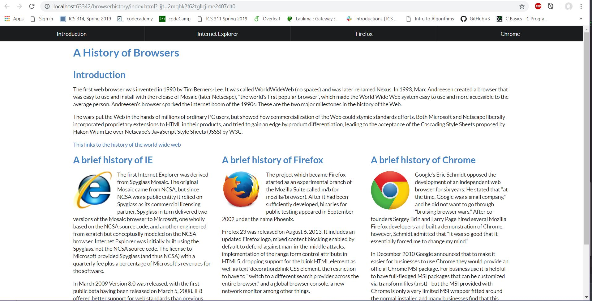

# Raw HTML & CSS-Who?
After interacting with Semantic UI for a short amount of time, I can honestly say that I am a fan. It is one of the easier languages to understand and to catch onto since we are able to look up most if not all of the functions that we could ever need. Not only is it more convenient but it also offers more “shorthand” versions of code. By this I mean that we are able to use less code to accomplish more. I have personally found this to be true in comparison to raw HTML and CSS code, which left me asking: raw HTML and CSS who?, who are they?, You won’t be able to catch me using those anytime soon. 

## Forget plain old HTML and CSS
When using straight HTML and CSS to code a web page I was often confronted with tedious details in order to even make a page somewhat presentable. Even then, after laboring over a single web page for several hours all we had to show for it was a mass of text on a web page that looked like it was generated on accident. It was almost unsightly since there were only so many things that we could customize without getting into much more complicated sequences of code. Overall, Semantic UI bridges the divide between HTML and more readable language that allows us to further customize the pages that we create.

## Reading is Important
Readable language is incorporated into Semantic UI by having a syntax that uses words that makes more sense in their context than in regular plain old HTML and CSS. An Example would be to put text into columns. In order to do this, we would first have to create id tags and classes in our HTML files that would link to our CSS classes. Then the CSS classes would handle most of the customization by floating the columns, adding padding, and setting the width of the columns. It adds extra work that is easily cut out with the use of Semantic UI. In Semantic UI we could instead use the UI frameworks called grid or columns to do the same formatting without having to touch our CSS unless we wanted to add extra formatting specifications. This also dramatically improves the appearance of our web page which can be shown in two representations of the same webpage first created with raw HTML and CSS and the second using Semantic UI.

We are able to see that the raw website is much simpler and would easily be glazed over and possibly written off as an unreliable source solely because of the way it looks. In some cases- yes looks do matter in order to see if what’s on the inside is worth a potential site-visitors time. We can also see that by using Semantic UI we are able to add a little more customization. The search bar shows just the beginning of how far we can take this. 

## The Conclusion
Although, having to learn Semantic UI seems like the same amount of work as learning any other language it allows me to create more professional looking web pages. It was worth all of the time, energy, and learning that is still occurring since the output that I receive is a web page that is more pleasing to the eye than an eye sore to look at.

