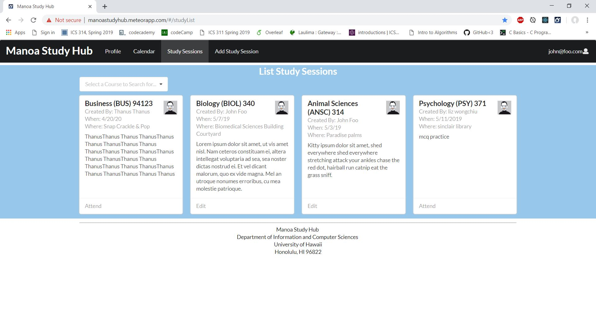
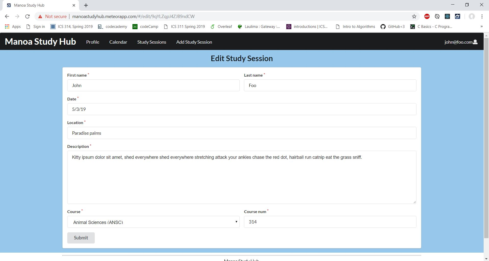
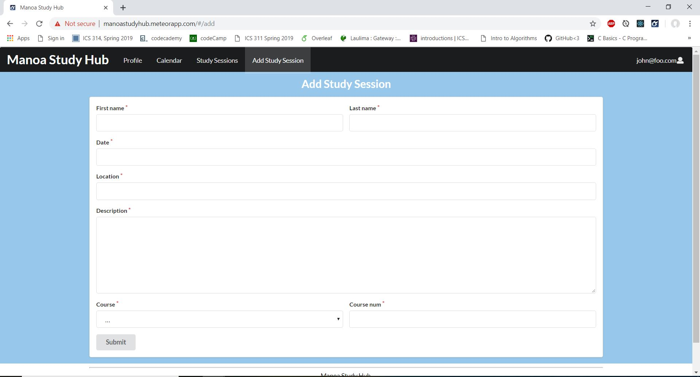

An issue that many students fall into in our technology driven era can be interacting with other students! [The Manoa Study Hub](http://manoastudyhub.meteorapp.com/#/) provides a solution for this predicament. The application was created by myself and four other group members. We were able to create a place where students would be able to go to organize their own study groups which would allow them to collaborate and work with other students or tutors who are in their classes. Within our application students are able to create a profile and add study sessions as well as keep track of past, current, and future study sessions that they have or intend to attend.

Some of the features within our application include being able to login or create a new account along with a profile. Once the user is logged in they are able to view and edit their profile as well as create and edit study sessions, view the calendar with available study sessions, and view the list of study sessions page. If they should choose to attend a study session they can do this too! All with the touch of a button which will add the corresponding study session to their profile page and calendar.

The features that I contributed to this project were that I created the list study sessions page, edit study session page, and the add study session page. Within the list study session page I worked with one of my other group members to try to solve the issue of connecting the attend study session button to the other aspects of our application. I was able to use the format that we learned and worked with within our previous assignments to create a card layout for our study sessions that includes all of the information that is relevant for the user to decide if they would like to attend the study session. I also added the feature of a select search bar. This search bar includes all of the possible courses that there may by study sessions for. The user is able to select multiple courses and if there are corresponding study sessions for those courses they will be filtered out below. 

From the list study session page users have the option to edit the study session only if they were the user who created it. They also do not have the option to attend the study session because if they created the session they are assumed to attend the session as well. Once they chose the edit option they are taken to a page that looks similar to the add study session page except it is already populated with the information for that study session. They are able to make their changes then they will be applied when they click submit, if all of the fields are filled out properly. 

Lastly, I worked on the implementation of the add study session page where you are able to fill out all of the fields with the correct information for your study session. If all of the fields are filled out properly they will then a new study session card will be added to the list study sessions page. On this page I included a drop down menu of all of the possible courses that are offered at UH Manoa and therefore the courses that study sessions are allowed for. This makes it easier to filter out the courses with the search bar on the list study session page and eliminates the possibility of typos in the course name.

Some things that I learned from working on this project include working in a team, and more about Meteor, React, and Semantic UI. By working in a team I believe that all of our members discovered that there are advantages and disadvantages when working in a group. An advantage was being able get input and help from the other team members when we got stuck. If one of us needed help we were all able to look at their work through the GitHub repository where our code was stored and could all work on resolving the problem. A disadvantage was that sometimes the work was unevenly distributed, although we tried to avoid this, when it came down to merging and putting all of our parts together and deploying our project to Galaxy so that it could be viewed on the web, it needed to be done by one person which left that member with a little extra work. However, we were mostly able to balance out the work load among all of the team members. Lastly, I think that we all learned more about Meteor, React, and Semantic UI. However, I found that creating a simple search bar was far more difficult than I initially thought. The inner workings of collections and linking the components and pages to each other turned out to be a much bigger monster to feed than I anticipated. 

If you wish to see more information on how our application works, and more details on the features that were incorperated into the project- you can visit our website [here](https://manoastudyhub.github.io/). If you would like to learn more about how our project was developed you can view our [GitHub Organization here](https://github.com/manoastudyhub).
