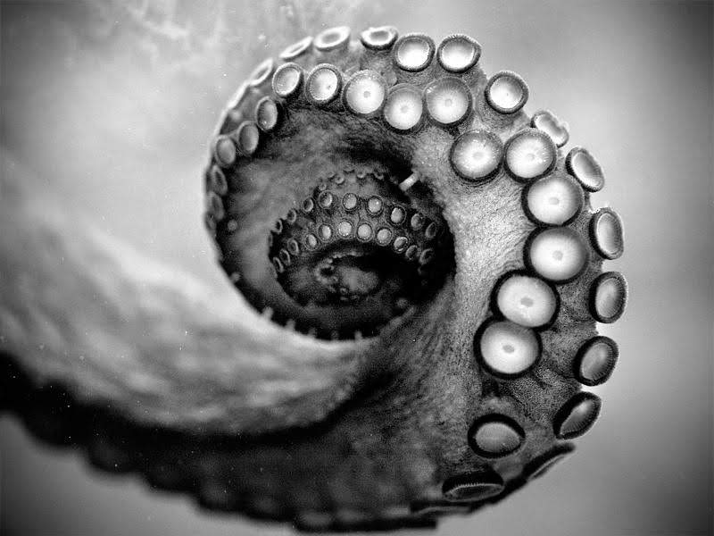
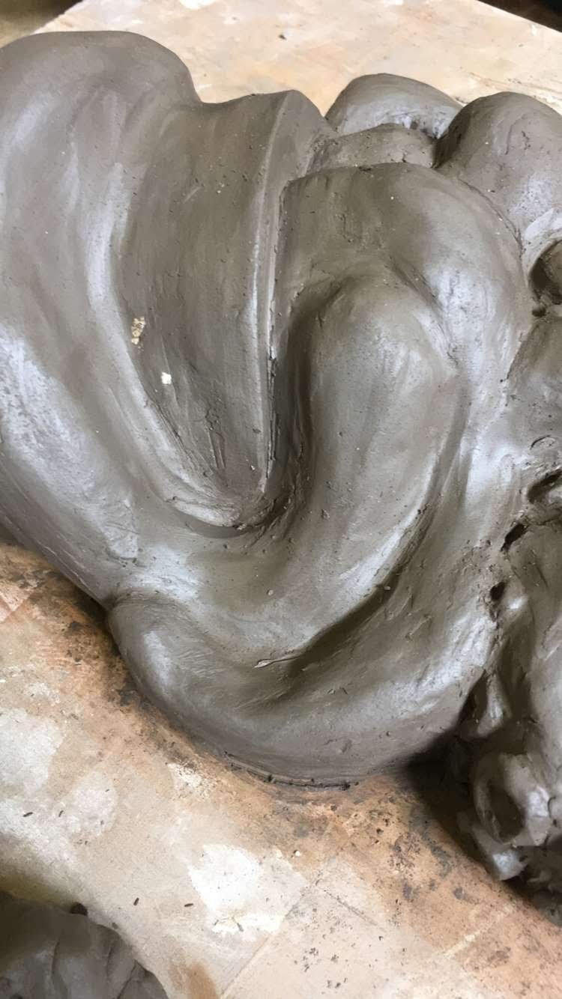
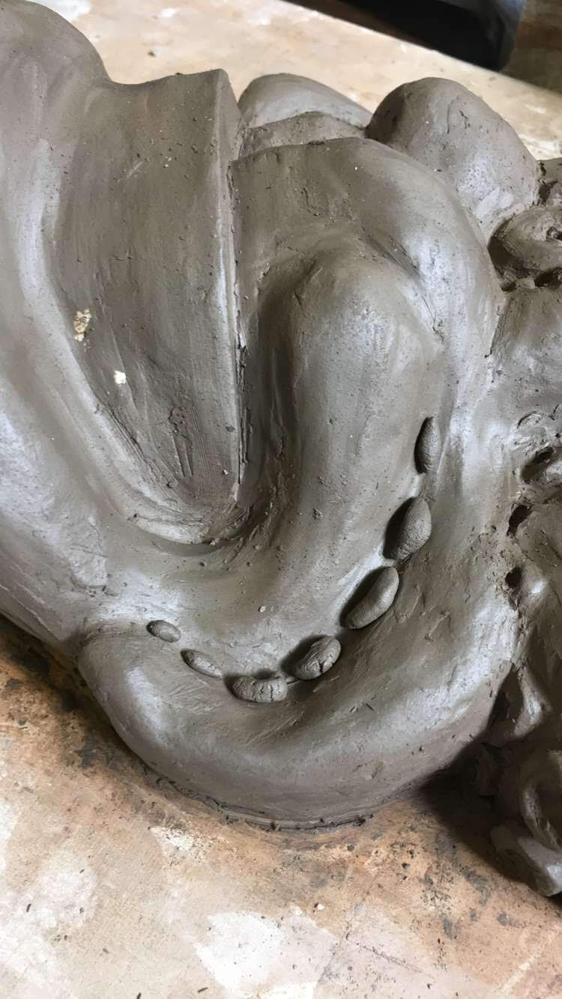
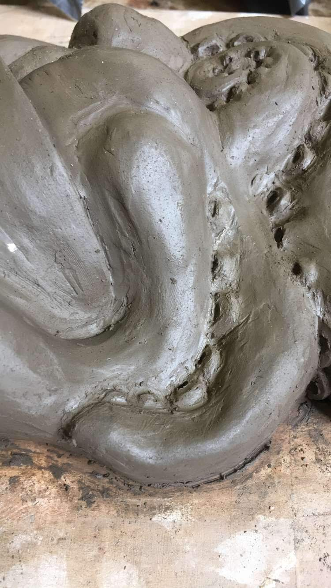
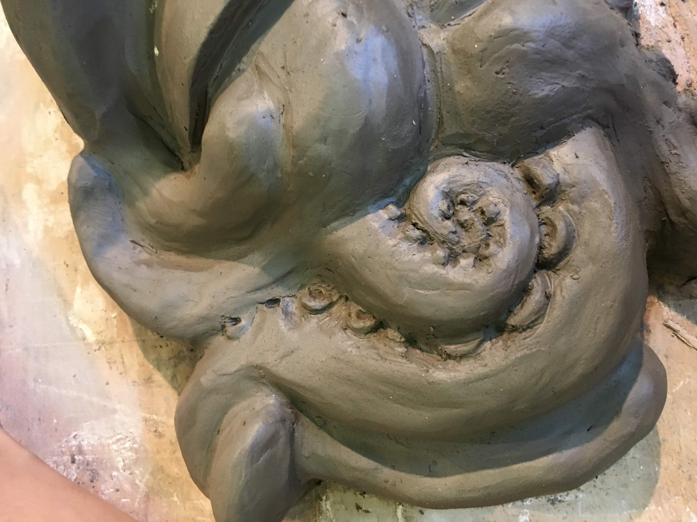
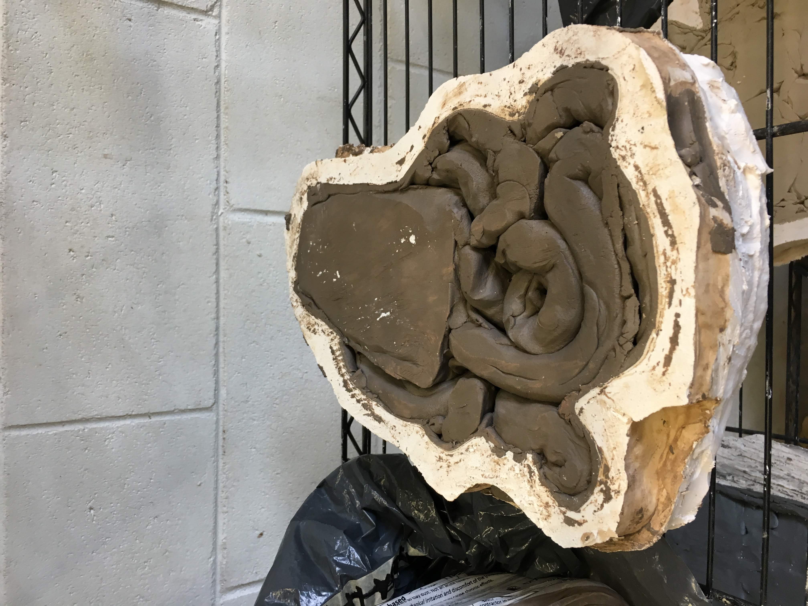
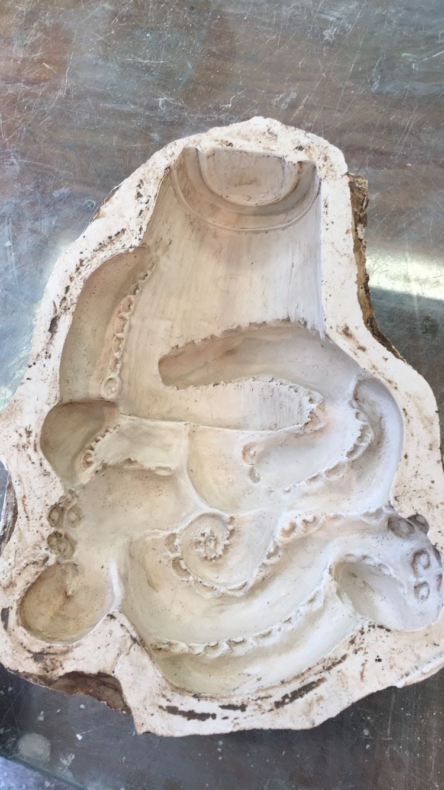
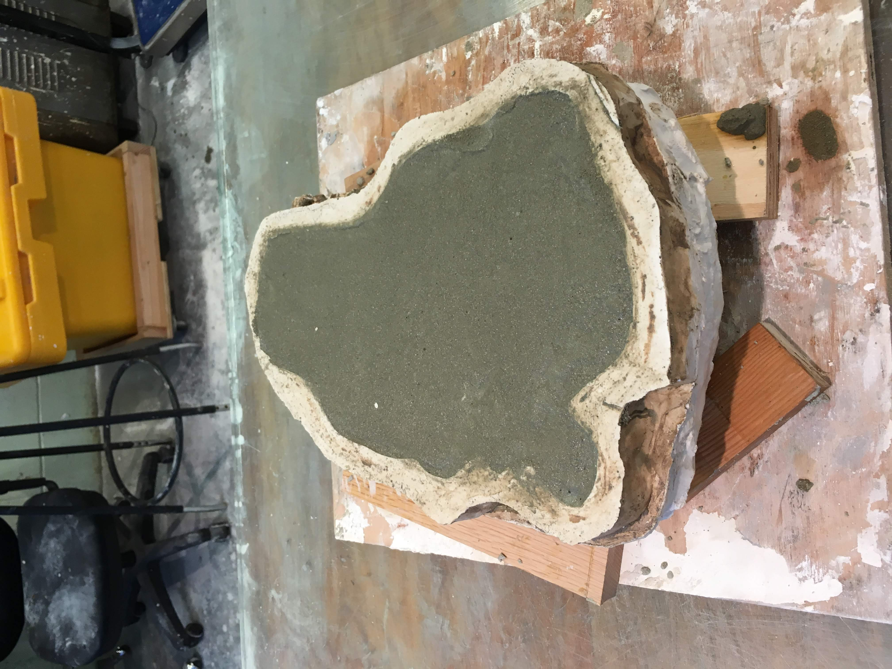
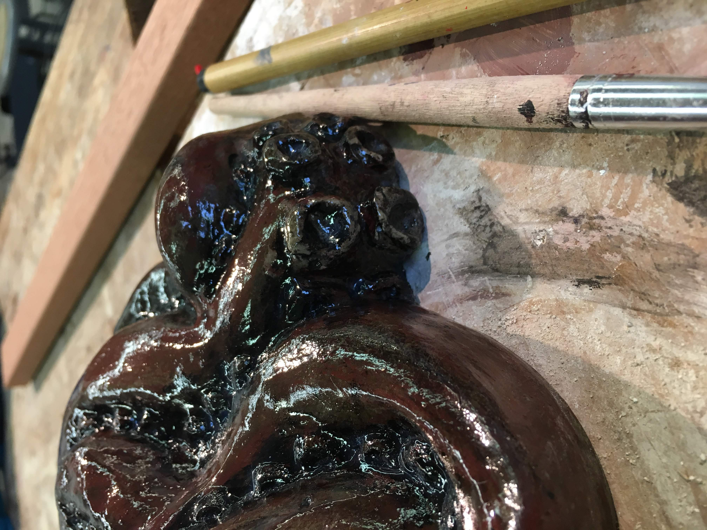
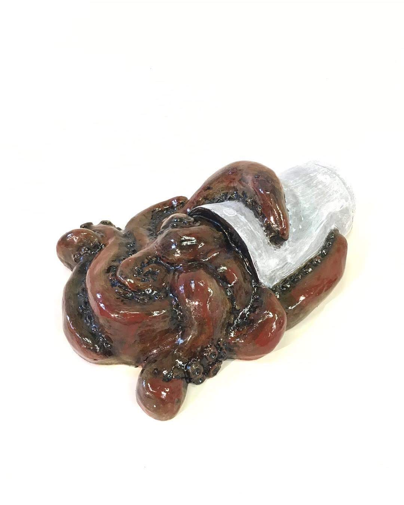

This project was created in my Art 116 class where we worked with sculpture media. For this project we were dealing with the mold making process. The medias that were used were clay, plaster, cement, paint, and varnish. The process took over four weeks and was very time consuming and messy. The basic outline of this process begins with creating a subject out of clay, then casting the clay object in plaster, then we remove the damp clay from the plaster, and can then add a the cement and allow it to "cure" then finally remove the plaster from the cement and polish and add details with paint and varnish.

  

As stated above, the first step in this process was to create an object that we could make a mold of. I chose an octopus since I wanted to make something unconventional and wanted to push the boundaries of what it was possible to create. When working with the mold making process we have to greatly consider the process of removing the plaster from the cement in the final steps. This is becuase we will often use a chisel and hammer, by doing so if our original design is too thin or fragile we will ultimately have wasted over four weeks of our lives as our work gets reduced to a pile of rubble. 

The pictures above show a little of the process of how I created the suction cups on the octopus' tenticles. I created the octopus coming out of a cup to touch on the issue of how we can become reliant on caffeine in a way such that we have an attachment to it and that it is part of us- like an appendange. 

 

This was the final design in clay. Each and every detail that was made on the clay also gets transferred to the plaster mold. This was important to keep in mind since it would ultimately transfer to our final piece. After the clay process we enter the plaster and actual mold making part. This part was very messy and hard to document with plaster covered hands. This process includes constantly mixing up new batches of plaster then splashing the liquid mixture onto our clay pieces and making sure that every nook was covered and that no air bubbles were present. We then added layers coninuously until the mold was about three to four inches thick. 

 

The first picture above shows the clay octopus piece casted inside the plaster mold. The clay was then dug out and removed, then scrubbed and thoroughly cleaned to achieve the white color that is shown in the second picture. After the plaster mold was removed from the clay we were able to enter one of the final stages- the cement process!

We then were able to add the cement into the plaster mold. The first layer consisted of pure cement which adds an extra shine. The rest of the mold was then filled with a sand-cement mixture to make the final piece more sturdy as well as to conserve the pure cement. After the cement is allowed to dry for several days, the cement-plaster pieces were soaked overnight submerged in water to allow the plaster to get soft which would make the removal a little easier. To remove the plaster we used chisels and hammers to carefully chip away at the thick layers around the cement without chipping the actual cement. 

Lastly we have our final piece, after the cement was chipped away and removed from the plaster mold, I was able to wash it clean and then add the final touches with paint to add color and varnish to give the octopus a wet look. Overall the process was extensive but beneficial to be able to learn about all of the differnet processes that go into making- what looks like a simple sculpture that may otherwise be overlooked by those who do not have knowledge of this process.
